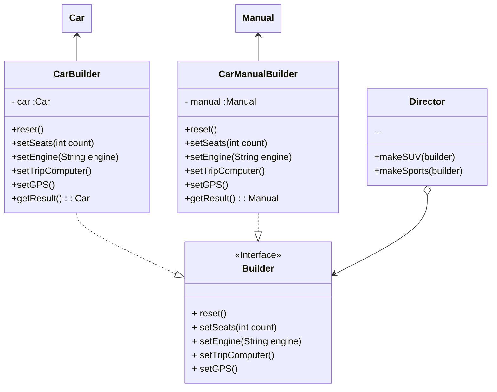

# Builder

## Insight

Builder 給出了一個步驟的概念，今天如果今天有不同的步驟則需要根據步驟來做不同的builder class。
並且我們還可以在創立一個director class 來控制builder class的步驟。

## Problem
The Builder pattern allows you to reuse object construction code across different product types. For example, you can use the same construction process for building both cars and their corresponding instruction manuals.

## UML

