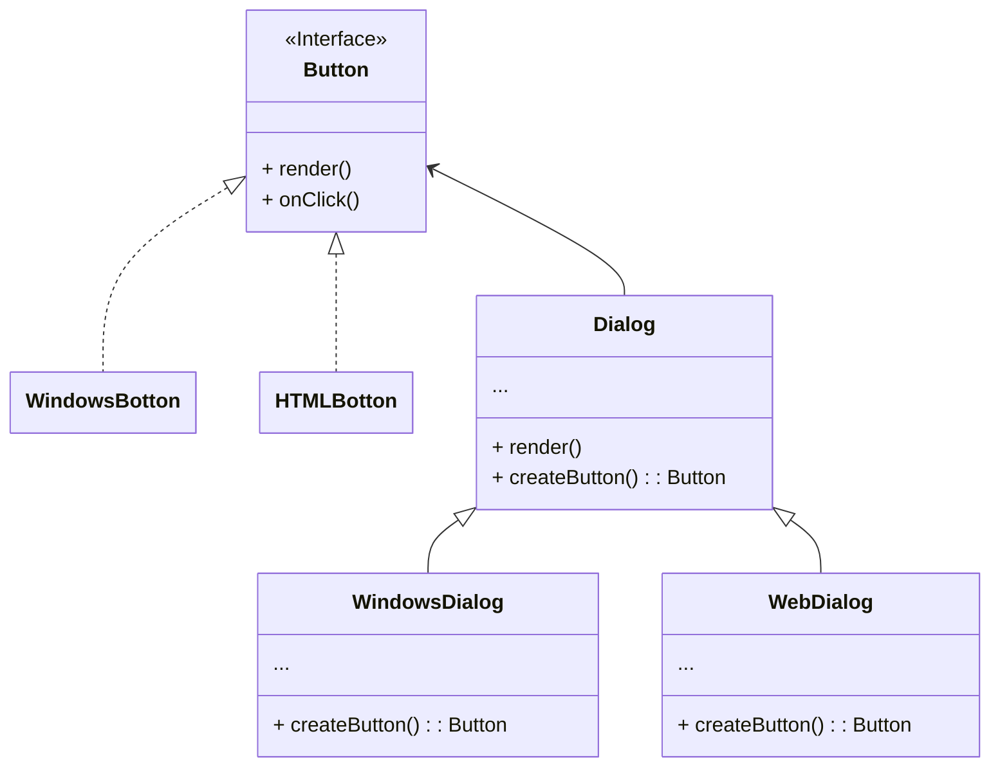

# Factory Method

## Problem

Creating UI elements that work consistently across different operating systems while avoiding tight coupling to specific OS implementations

## UML

```mermaid
---
  config:
    class:
      hideEmptyMembersBox: true
---
classDiagram
    class Button {
        <<Interface>>
        + render()
        + onClick()
    }

    class WindowsBotton
    class HTMLBotton

    class Dialog {
        ...
        + render()
        + createButton() : Button
    }

    class WindowsDialog{
        ...
        + createButton() : Button
    }

    class WebDialog{
        ...
        + createButton() : Button
    }

    
    Button <|.. WindowsBotton
    Button <|.. HTMLBotton
    Dialog <|-- WindowsDialog
    Dialog <|-- WebDialog
    Button <-- Dialog
```