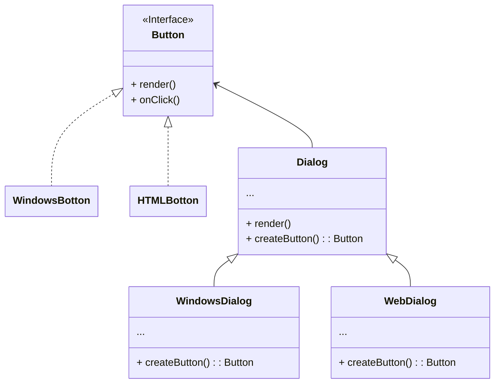

# Factory Method

## Insight

Factory Method 給出了一個模板的概念，其中factory 以及factory 所產生的 object 都是有對應的模板，今天如果有不同的物件則需要根據模板時做不同的factory class以及對應的object class。 

## Problem

Creating UI elements that work consistently across different operating systems while avoiding tight coupling to specific OS implementations

## UML

